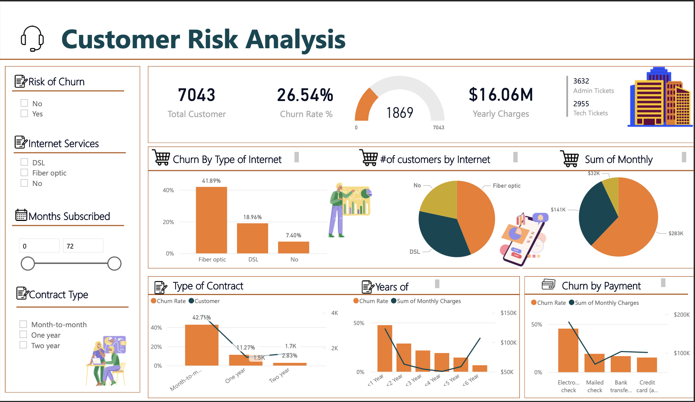

# PwC Switzerland Data Analyst - PowerBI Job Simulation

## Introduction
This project is part of the PwC Switzerland Power BI in Data Analytics Virtual Case Experience, demonstrating the application of digital tools in data visualization, automation, data cleansing, and more to address common business challenges. It features a series of Power BI dashboards focusing on Call Centre Trends, Customer Retention, and Diversity & Inclusion. Each dashboard provides actionable insights into different facets of business operations and strategic planning, aiding PwC Switzerland and its clients in enhancing operational efficiency, fostering customer loyalty, and promoting a more inclusive workplace.

Through meticulous data analysis and visualization, this project aims to support informed decision-making and highlight areas for improvement and innovation.

## Technical Stack

**Visualization**:
- Microsoft PowerBI
- Microsoft PowerPoint *(design layout)*
  
# Tasks

This virtual experience program consists of 3 tasks:                    
- **Task 1**: Create Call Centre Dashboard - visualizing customer and agent behavior.
- **Task 2**: Create Customer Retention and predict churn customers - visualizing customer demographics and insights.
- **Task 3**: Create Diversity and Inclusion in HR - visualizing gender balance in the executive suite.

# Data Sourcing

The Dataset used for this analysis was provided by [Pwc Switzerland](https://www.pwc.ch/en/careers-with-pwc/students/virtual-case-experience.html) and available here: [Call Center Dataset]

# Data Preparation

The dataset was loaded into Microsoft Power BI Desktop for transformation in Power Query and modeling.

### Data Cleaning

Data Cleaning for the dataset was done in Power Query as follows:

- Unnecessary columns were removed
- Each of the columns in the table was validated to have the correct data type
- Unnecessary rows were removed

# Data Modeling

After the dataset was cleaned and transformed, it was ready to be modeled, but the dataset just included one table, so the Data Modeling is nothing much to modify

# Visualization

# Dashboard Links

### [Task 1 : Call Center Trends Dashboard](https://app.powerbi.com/view?r=eyJrIjoiZWNjN2VjODItNGQwNi00YTIxLTk2OGItNjBiZjVlY2U3NTk0IiwidCI6IjM0YmQ4YmVkLTJhYzEtNDFhZS05ZjA4LTRlMGEzZjExNzA2YyJ9)

### [Task 2 : Churn Analysis Dashboard](https://app.powerbi.com/view?r=eyJrIjoiNjY5YzMxZDgtMWUxNi00YTMxLTkwNDItYTFmNGVlMzdhOWMyIiwidCI6IjM0YmQ4YmVkLTJhYzEtNDFhZS05ZjA4LTRlMGEzZjExNzA2YyJ9)

### [Task 3 : Diversity Inclusion Dashboard](https://app.powerbi.com/view?r=eyJrIjoiYzBjNTY0ZDktY2RhNS00YzFlLWI4MGEtNmQ4MWNlMDgyOTg1IiwidCI6IjM0YmQ4YmVkLTJhYzEtNDFhZS05ZjA4LTRlMGEzZjExNzA2YyJ9)

# [Certificate](PwC Switzerland_certificate.pdf)