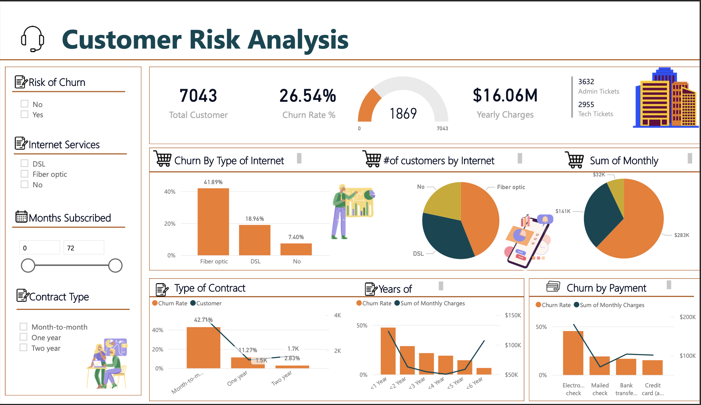

# Microsoft-Power-BI-PWC-PowerBI-Virtual-Case-Experience

# </a> PWC PowerBI Virtual Case Experience 

 

## Introduction
This repository displays the process and outcomes of the tasks completed during the [PwC Switzerland PowerBI Virtual Case Experience](https://www.theforage.com/virtual-internships/prototype/a87GpgE6tiku7q3gu/Power%20BI?ref=W5vwWAjutTpHbEraC) developed by Forage. The virtual internship is created to simulate work in the Digital Accelerator team at PwC Switzerland and leverages Power BI.

 

## Scenario
At PwC, we work with global organizations, upskilling our 276,000 employees. Our goal is to provide everyone with the opportunity to learn, work, and participate in the digital world. Our employees have the chance to become "Digital Accelerators" by rapidly deepening their skills in digital specialties such as data, automation, AI, and digital storytelling. They do this by learning self-service tools and coding languages and applying these skills across our business.
Your manager, Giulia, will guide you through your upskilling journey in PowerBI. You'll become a data Jedi and Digital Accelerator. An important client (communication has already reached out to you for help visualizing their data.

This virtual experience program consists of 3 tasks:                    
- **Task 1**: Create Call Centre Dashboard - visualizing customer and agent behavior.
- **Task 2**: Create Customer Retention and predict churn customers - visualizing customer demographics and insights.
- **Task 3**: Create Diversity and Inclusion in HR - visualizing gender balance in the executive suite.

 

## Technical Stack

**Visualization**:
- Microsoft PowerBI
- Microsoft PowerPoint *(design layout)*
  

**Predictive analysis**:
- Language: Python 3.11
- Package: Pandas, Numpy, scikit-learn, XGBoost

 Task Two: Call Center Analysis | Pwc Switzerland Power BI Virtual Case Experience 
  

## Table of contents
- [Problem Statement](#problem-statement)
- [Data Preparation](#data-preparation)
- [Data Modeling](#data-modeling)
- [Data Visualization](#data-visualization)
- [Analysis and Insights](#analysis-and-insights)
- [Dashboard Link](#dashboar-links)

# Problem Statement

- **Problem:** The manager at PhoneNow (a big telecom company) is seeking transparency and insight into the Call Center dataset to gain an accurate overview of long-term customer and agent behavior trends.
- **Objective:** The purpose of this analysis is to create a dashboard in Power BI for Call Center Manager that reflects all relevant Key Performance Indicators (KPIs) and metrics to:
    - Self-exploratory call trends
    - Overview of the agent’s performance and behaviors
    - Overview the customer satisfaction
    - Contain many metrics and plots related to a single area of business for discussing with higher managers and generating further analysis.
    - Allows for minimal interaction
- **Possible KPIs** include (but are not limited to):
    - Overall customer satisfaction
    - Overall calls answered/abandoned
    - Calls by time
    - Average speed of answer
    - Agents performance quadrant -> average handle time(talk duration) vs calls answered

# Data Sourcing

The Dataset used for this analysis was provided by [Pwc Switzerland](https://www.pwc.ch/en/careers-with-pwc/students/virtual-case-experience.html) and available here: [Call Center Dataset]

# Data Preparation

The dataset was loaded into Microsoft Power BI Desktop for transformation in Power Query and modeling.

### Metadata

The tabulation below shows the metadata of `Call Center` dataset:

| File name |01 Call-Center-Dataset  |
| --- | --- |
| Format | .xlsx |
| Size | 249KB |
| Fields | 10 |
| Entities | 5000 |

The tabulation below shows the `Call Center` table with its fields names and their description:

| Field Name | Description | Data Type |
| --- | --- | --- |
| Call Id | Represents every unique observation in the dataset | Text  |
| Agent | Describes the name of the agent | Text |
| Date | Describes the date of the call | Date |
| Time | Represents the time of the call | Date/Time |
| Topic | Describes the topic of the caller | Text |
| Answered (Y/N) | Describes if the call was answered or not | Text |
| Resolved | Describes if the problem was Resolved or not | Text |
| Speed of answer in seconds | Represents the speed of answer in seconds | Decimal number |
| AvgTalkDuration | Represents the average talk duration of a call | Time |
| Satisfaction rating | Represents the satisfaction rating of the agent during the call | Decimal number |

### Data Cleaning

Data Cleaning for the dataset was done in Power Query as follows:

- Unnecessary columns were removed
- Each of the columns in the table was validated to have the correct data type
- Unnecessary rows were removed

### Data Transformation

To ensure the comprehensive satisfaction of customers, an additional column named `Satisfaction Likert` was created for referencing using the M-formula: 

`Table.AddColumn(#"Added Custom", "Satisfaction Likert", each if [Satisfaction rating] = 1 then "Very poor" else if [Satisfaction rating] = 2 then "Poor" else if [Satisfaction rating] = 3 then "Average" else if [Satisfaction rating] = 4 then "Good" else "Very good")`

Here is a breakdown of what the formula does:

For the dataset, we want to transform the satisfaction rating from number to text based on the Likert scale with the condition if `Satisfaction rating = 1`, it will display the rating as `“Very poor”`, respectively for each value of `Satisfaction rating` .

# Data Modeling

After the dataset was cleaned and transformed, it was ready to be modeled, but the dataset just included one table, so the Data Modeling is nothing much to modify

# Data Visualization

Data visualization for the datasets was done in Microsoft Power BI Desktop and designed in PowerPoint, the dashboard includes:

- One main dashboard
- Six tooltip pages

### Key Performance Indicators and Metrics:

**About Calls and Agents:** 

- Overall calls answered/abandoned
- Calls received by time, day 
- Average speed of answer, handle duration
- Resolved rate by Agents, Topics
- Agent’s performance quadrant -> average handle time (talk duration) vs calls answered

**About Customer satisfaction:**

- Overall customer satisfaction
- Customer satisfaction distribution by Agents, Topics
### Measures

The measure used in visualization are:

- **Calculated measures:**

  - Number of answered = `Calculate(distinctcount('Call Center'[Call Id]),Filter('Call Center','Call Center'[Answered (Y/N)]="Y"))`
  - Abandoned Rate = `DIVIDE(COUNT('Call Center'[Call Id]) - [Number of Answer], COUNT('Call Center'[Call Id]))`
  - Number of resolved = `Calculate(distinctcount('Call Center'[Call Id]),Filter('Call Center','Call Center'[Resolved]="Y"))`
  - Average satisfaction rating = `Average('Call Center'[Satisfaction rating])`
  - Average Speed of answer = `Average('Call Center'[Average Speed of answer in seconds])`
  - Operation hour DAX = `FORMAT('Call Center'[Time], "hh:mm")`
  - duration = `MINUTE('Call Center'[AvgTalkDuration])*60 + SECOND('Call Center'[AvgTalkDuration])`
- **Format measures:**

  - Welcome text = `VAR Hour = HOUR(NOW())
  VAR Greeting = 
  SWITCH(
      TRUE(),
      Hour >= 0 && Hour < 5, "Good Night",
      Hour >= 5 && Hour < 12, "Good Morning",
      Hour >= 12 && Hour < 18, "Good Afternoon",
      Hour >= 18 && Hour < 24, "Good Evening"
  )
  RETURN
  Greeting & " " & "Manager!"`
  - Show filter =

      `-- Agents
      IF(
          ISFILTERED('Call Center'[Agent]),
          VAR Agents = VALUES('Call Center'[Agent])
          VAR Agentscombined = CONCATENATEX(Agents, 'Call Center'[Agent], UNICHAR(10))
          RETURN Agentscombined & UNICHAR(10)
      )&
      --Topics
      IF(
          ISFILTERED('Call Center'[Topic]),
          VAR Topics = VALUES('Call Center'[Topic])
          VAR Topicscombined = CONCATENATEX(Topics, 'Call Center'[Topic], UNICHAR(10))
          RETURN Topicscombined & UNICHAR(10)
      )`

  - Show header filter =

      `-- Header of agent
      IF( 
          ISFILTERED('Call Center'[Agent]),
          "Agent: " & REPT(UNICHAR(10), COUNTROWS(VALUES('Call Center'[Agent])))
      ) &
      -- Header of agent
      IF( 
          ISFILTERED('Call Center'[Topic]),
          "Topic: " & REPT(UNICHAR(10), COUNTROWS(VALUES('Call Center'[Topic])))
      )`

# Analysis and Insights
The purpose of this dashboard is to serve as self-exploratory for managers, but I still note some highlighted points that I recognize below:

********************About Call trends:********************

- Customers tend to call more between 5:00 pm - 5:30 pm at 250 calls received with an abandoned rate is 18.40% (approximately to the average abandoned rate) and distributed mainly in the middle of the month
- The highest abandoned rate is 28.03% between 1:00 pm - 1:30 pm
- Customers have more problems with Streaming service
- The resolved rate is at a high rate (89,94%)

********************About performance of agents:********************

- The agent who satisfies customers most is Becky with a 12.02% of “Very good” rating
- The agent who has the highest resolved rate is Jim and he is effective with solving problems related to “Contract related” and “Admin Support”

********************About customer satisfaction:********************

- The average customer satisfaction is at an acceptable rate with 3.40, mainly comes from “Average” (30.04%) and “Good” (29.11%) rating
- The correlation between call answered and call resolved is strongly positive which resulted in a increase in the customer satisfaction rate

# Dashboar Links

### [Task 1 : Call Center Trends Dashboard](https://app.powerbi.com/view?r=eyJrIjoiZWNjN2VjODItNGQwNi00YTIxLTk2OGItNjBiZjVlY2U3NTk0IiwidCI6IjM0YmQ4YmVkLTJhYzEtNDFhZS05ZjA4LTRlMGEzZjExNzA2YyJ9)
<iframe title="Call Center Trends" width="600" height="373.5" src="https://app.powerbi.com/view?r=eyJrIjoiZWNjN2VjODItNGQwNi00YTIxLTk2OGItNjBiZjVlY2U3NTk0IiwidCI6IjM0YmQ4YmVkLTJhYzEtNDFhZS05ZjA4LTRlMGEzZjExNzA2YyJ9" frameborder="0" allowFullScreen="true"></iframe>

### [Task 2 : Churn Analysis Dashboard](https://app.powerbi.com/view?r=eyJrIjoiNjY5YzMxZDgtMWUxNi00YTMxLTkwNDItYTFmNGVlMzdhOWMyIiwidCI6IjM0YmQ4YmVkLTJhYzEtNDFhZS05ZjA4LTRlMGEzZjExNzA2YyJ9)
<iframe title="churn analysis" width="600" height="373.5" src="https://app.powerbi.com/view?r=eyJrIjoiNjY5YzMxZDgtMWUxNi00YTMxLTkwNDItYTFmNGVlMzdhOWMyIiwidCI6IjM0YmQ4YmVkLTJhYzEtNDFhZS05ZjA4LTRlMGEzZjExNzA2YyJ9" frameborder="0" allowFullScreen="true"></iframe>

### [Task 3 : Diversity Inclusion Dashboard](https://app.powerbi.com/view?r=eyJrIjoiYzBjNTY0ZDktY2RhNS00YzFlLWI4MGEtNmQ4MWNlMDgyOTg1IiwidCI6IjM0YmQ4YmVkLTJhYzEtNDFhZS05ZjA4LTRlMGEzZjExNzA2YyJ9)
<iframe title="Diversity Inclusion" width="600" height="373.5" src="https://app.powerbi.com/view?r=eyJrIjoiYzBjNTY0ZDktY2RhNS00YzFlLWI4MGEtNmQ4MWNlMDgyOTg1IiwidCI6IjM0YmQ4YmVkLTJhYzEtNDFhZS05ZjA4LTRlMGEzZjExNzA2YyJ9" frameborder="0" allowFullScreen="true"></iframe>

# [Certificate](PwC Switzerland_certificate.pdf)